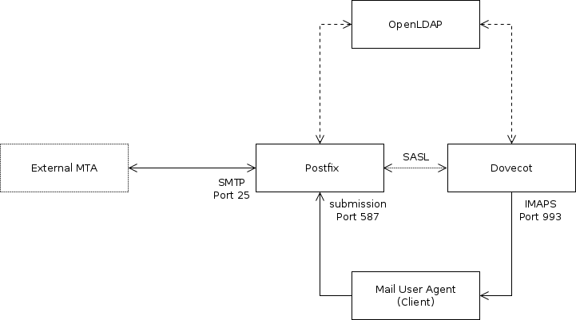

<!-- [![Contributors][contributors-shield]][contributors-url]
[![Forks][forks-shield]][forks-url]
[![Stargazers][stars-shield]][stars-url]
[![Issues][issues-shield]][issues-url]
[![MIT License][license-shield]][license-url]
[![LinkedIn][linkedin-shield]][linkedin-url]
 -->


<!-- PROJECT LOGO -->
<br />
<p align="center">
  <a href="https://github.com/dorukalioglu/ldap">
    
    
  </a>

  <h3 align="center">LDAP Postfix and Dovecot Auth on Ubuntu 20.04</h3>
</p>


<!-- TABLE OF CONTENTS -->
## Table of Contents

* [About the Project](#about-the-project)
  * [Built With](#built-with)
* [Getting Started](#getting-started)
  * [Prerequisites](#prerequisites)
  * [Installation](#installation)
* [Usage](#usage)
* [Roadmap](#roadmap)
* [Contributing](#contributing)
* [License](#license)
* [Contact](#contact)
* [Acknowledgements](#acknowledgements)


<!-- ABOUT THE PROJECT -->
## About The Project

This project made for Authentication of `Lightweight Directory Access Protocol (LDAP)`, `Postfix` and `Dovecot`. **Basically installation of a mailserver**, in order for them to be connected to
each other, and help with address lookup and aliases.
<br>
* `Ubuntu 20.02`<br>
* `Users don’t have system accounts on the Unix machine`<br>
* `User accounts are virtual accounts stored in an LDAP`


### Built With

* [OpenLDAP](https://www.openldap.org/)
* [Postfix](http://www.postfix.org/)
* [Dovecot](https://www.dovecot.org/)


<!-- GETTING STARTED -->
## Getting Started

To get a local copy up and running follow these simple steps.

### Installation
<p>
This is an example of how to list things you need to use the software and how to install them.
* LDAP
```sh
apt-get install slapd ldap-utils
```
After installation, you can see running LDAP port on 389:
```sh
lsof -Pni :389
``` 
<br>
The configuration can be found in <em>/etc/ldap</em>. Here’s a short explanation of the existing files/folders:

|LDAP Folder                |Explanation                                                    |
|---------------------------|---------------------------------------------------------------|
|sasl2/                     |Used for SASL authentication. Initially empty and unconfigured.|
|schema/                    |Contains the included schema and ldif files.                   |
|slapd.d/                   |The LDAP server’s configuration storage.                       |
|slapd.d/cn=config          |Contains the server configuration and directory databases.     |
|slapd.d/cn=config/cn=schema|Contains the currently loaded schemas.                         |
|ldap.conf                  |Used to define system-wide defaults for LDAP clients.          |

</p>
<!-- USAGE EXAMPLES -->
## Usage

Use this space to show useful examples of how a project can be used. Additional screenshots, code examples and demos work well in this space. You may also link to more resources.

_For more examples, please refer to the [Documentation](https://example.com)_


<!-- ROADMAP -->
## Roadmap

See the [open issues](https://github.com/github_username/repo_name/issues) for a list of proposed features (and known issues).


<!-- CONTRIBUTING -->
## Contributing

Contributions are what make the open source community such an amazing place to be learn, inspire, and create. Any contributions you make are **greatly appreciated**.

1. Fork the Project
2. Create your Feature Branch (`git checkout -b feature/AmazingFeature`)
3. Commit your Changes (`git commit -m 'Add some AmazingFeature'`)
4. Push to the Branch (`git push origin feature/AmazingFeature`)
5. Open a Pull Request


<!-- LICENSE -->
## License

Distributed under the MIT License. See `LICENSE` for more information.


<!-- CONTACT -->
## Contact

Your Name - [@twitter_handle](https://twitter.com/twitter_handle) - email

Project Link: [https://github.com/github_username/repo_name](https://github.com/github_username/repo_name)


<!-- ACKNOWLEDGEMENTS -->
## Acknowledgements

* []()
* []()
* []()


<!-- MARKDOWN LINKS & IMAGES -->
<!-- https://www.markdownguide.org/basic-syntax/#reference-style-links -->
[contributors-shield]: https://img.shields.io/github/contributors/github_username/repo.svg?style=flat-square
[contributors-url]: https://github.com/github_username/repo/graphs/contributors
[forks-shield]: https://img.shields.io/github/forks/github_username/repo.svg?style=flat-square
[forks-url]: https://github.com/github_username/repo/network/members
[stars-shield]: https://img.shields.io/github/stars/github_username/repo.svg?style=flat-square
[stars-url]: https://github.com/github_username/repo/stargazers
[issues-shield]: https://img.shields.io/github/issues/github_username/repo.svg?style=flat-square
[issues-url]: https://github.com/github_username/repo/issues
[license-shield]: https://img.shields.io/github/license/github_username/repo.svg?style=flat-square
[license-url]: https://github.com/github_username/repo/blob/master/LICENSE.txt
[linkedin-shield]: https://img.shields.io/badge/-LinkedIn-black.svg?style=flat-square&logo=linkedin&colorB=555
[linkedin-url]: https://linkedin.com/in/github_username
[product-screenshot]: images/screenshot.png
