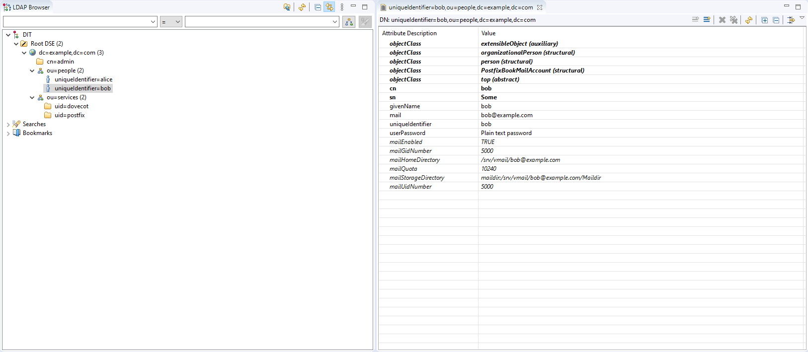
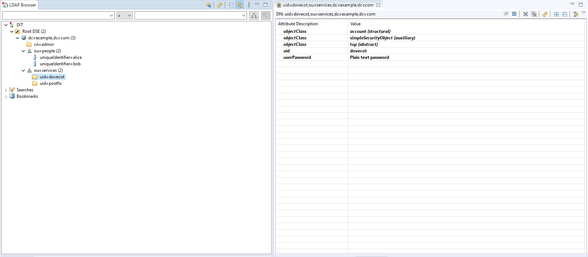

<!-- [![Contributors][contributors-shield]][contributors-url]
[![Forks][forks-shield]][forks-url]
[![Stargazers][stars-shield]][stars-url]
[![Issues][issues-shield]][issues-url]
[![MIT License][license-shield]][license-url]
[![LinkedIn][linkedin-shield]][linkedin-url]
 -->


<!-- PROJECT LOGO -->
<br />
<p align="center">
  <a href="https://www.openldap.org/">
    
  </a>
  <a href="http://www.postfix.org">
    
  </a>
  <a href="https://www.dovecot.org">
    
  </a>

  <h3 align="center">LDAP Postfix and Dovecot Auth on Ubuntu 20.04</h3>
</p>


<!-- TABLE OF CONTENTS -->
## Table of Contents

- [Table of Contents](#table-of-contents)
- [About The Project](#about-the-project)
  - [Built With](#built-with)
- [Getting Started](#getting-started)
  - [LDAP](#ldap)
    - [LDAP Installation](#ldap-installation)
    - [Custom Directory Creation](#custom-directory-creation)
    - [A First Test](#a-first-test)
    - [Directory Modification](#directory-modification)
    - [Load an Additional Schemas](#load-an-additional-schemas)
    - [Adding Users by LDIF File](#adding-users-by-ldif-file)
    - [LDAP Configuration for Test](#ldap-configuration-for-test)
  - [Postfix](#postfix)
    - [Postfix Installation](#postfix-installation)
    - [Configuration](#configuration)
    - [Hashmap Creation](#hashmap-creation)
    - [Starting Postfix -->](#starting-postfix---)
    - [SMTP Connection Test](#smtp-connection-test)
    - [LDAP Lookup Test](#ldap-lookup-test)
  - [Dovecot](#dovecot)
    - [Dovecot Installation](#dovecot-installation)
    - [Configuration](#configuration-1)
    - [Starting Dovecot](#starting-dovecot)
    - [IMAP Connection & Authentication Test](#imap-connection--authentication-test)
    - [Postfix Integration](#postfix-integration)
    - [Dovecot Deliver Test](#dovecot-deliver-test)


<!-- ABOUT THE PROJECT -->
## About The Project

This project made for Authentication of `Lightweight Directory Access Protocol (LDAP)`, `Postfix` and `Dovecot`. **Basically installation of a mailserver**, in order for them to be connected to
each other, and help with address lookup and aliases.
<br>
* `Ubuntu 20.02`<br>
* `Users don’t have system accounts on the Unix machine`<br>
* `User accounts are virtual accounts stored in an LDAP`


### Built With

* [OpenLDAP](https://www.openldap.org/)
* [Postfix](http://www.postfix.org/)
* [Dovecot](https://www.dovecot.org/)


<!-- GETTING STARTED -->
## Getting Started

To get a local copy up and running follow these simple steps.

### LDAP 

This is the directory service that stores the (virtual) user accounts for the mail server.

#### LDAP Installation

This is an example of how to list things you need to use the software and how to install them.
* LDAP
```sh
apt-get install slapd ldap-utils
```
After installation, you can see running LDAP port on 389:
```sh
lsof -Pni :389
``` 
<br>

The configuration can be found in __/etc/ldap__ . Here’s a short explanation of the existing files/folders:
<br>
| LDAP Folder                 | Explanation                                                     |
| --------------------------- | --------------------------------------------------------------- |
| sasl2/                      | Used for SASL authentication. Initially empty and unconfigured. |
| schema/                     | Contains the included schema and ldif files.                    |
| slapd.d/                    | The LDAP server’s configuration storage.                        |
| slapd.d/cn=config           | Contains the server configuration and directory databases.      |
| slapd.d/cn=config/cn=schema | Contains the currently loaded schemas.                          |
| ldap.conf                   | Used to define system-wide defaults for LDAP clients.           |


The actual database, that is automatically built from this configuration, is stored in /var/lib/ldap.
#### Custom Directory Creation
Now that slapd is running, you can set up your own directory. This can be done by hand (writing and importing LDIF files) or – on Ubuntu – with the Debian Packet Manager (dpkg). This however should only be used for a first-time setup.
```sh
dpkg-reconfigure slapd
```
<br>


| Config Question                       | Answer      | Explanation                                                                          |
| ------------------------------------- | ----------- | ------------------------------------------------------------------------------------ |
| Omit OpenLDAP server configuration?   | No          | This will start the configuration wizard.                                            |
| DNS domain name:                      | example.com | Name of your directory (this will result in a BaseDN of the form dc=example,dc=com). |
| Organization name:                    | example     | Name of your organization.                                                           |
| Administrator password:               | secret      | New password for the LDAP Administrator (cn=admin,dc=example,dc=com).                |
| Database backend to use:              | HDB         | Based on Oracle Berkeley Database (BDB) but more effective.                          |
| Remove database when slapd is purged? | No          | Keep the database if OpenLDAP is uninstalled.                                        |
| Move old database?                    | Yes         | Remove the old database so that it does not interfere with the new configuration.    |


The dc=nodomain has now been replaced with dc=example,dc=com.

#### A First Test
This query should return two DNs: your directory (dc=example,dc=com) and your admin account (cn=admin,dc=example,dc=com).

```sh
ldapsearch -x -W -D cn=admin,dc=example,dc=com -b dc=example,dc=com -LLL
```

#### Directory Modification
1. Modifying the config in /etc/ldap/slapd.d directly (not recommended!)
2. Using the ldap-utils (ldapadd, ldapdelete, ldapmodify, …)
3. Using a graphical user interface (i.e. Apache Directory Studio)

#### Load an Additional Schemas
To load a schema with ldapadd, it has to be in LDIF format, so it must be converted first. The conversion can be done with slapcat. You’ll need a config file and an output directory:
```sh
cd /etc/ldap/schema
mkdir ldif_output
touch schema_convert.conf
```
<br>
The schema_convert.conf file contains the schema to be converted (and any dependencies):
<br>

```sh
include /etc/ldap/schema/core.schema
include /etc/ldap/schema/cosine.schema
include /etc/ldap/schema/nis.schema
include /etc/ldap/schema/inetorgperson.schema
include /etc/ldap/schema/postfix-book.schema
include /etc/ldap/schema/postfix.schema
```
>**Note:**You can find postfix.schema on [here](https://geek.co.il/articles/postfix/postfix.schema). Also other contributed schemas available on [here](https://github.com/variablenix/ldap-mail-schema)

Start the conversion:

```sh
slapcat -f schema_convert.conf -F ./ldif_output/ -n0
```

Copy the corresponding output file to /etc/ldap/schema:
```sh
cp /etc/ldap/schema/ldif_output/cn\=config/cn\=schema/cn\=\{4\}postfix-book.ldif /etc/ldap/schema/postfix-book.ldif
```
Finally, in the postfix-book.ldif, the following changes need to be made:
  * dn: cn=postfix-book,cn=schema,cn=config
  * cn: postfix-book
  * Remove the metadata starting from structuralObjectClass

Then add it to the directory as follows:
```sh
sudo ldapadd -Y EXTERNAL -H ldapi:/// -f postfix-book.ldif
```

The new attributes of PostfixBookMailAccount are available from now on.
If not, try a restart (/etc/init.d slapd restart).

#### Adding Users by LDIF File
Create a userimport.ldif with the following content to add a single user (the value for userPassword can be generated with slappasswd):
```sh
# Some User
dn: uniqueIdentifier=test1,ou=people,dc=example,dc=com
objectClass: organizationalPerson
objectClass: person
objectClass: top
objectClass: PostfixBookMailAccount
objectClass: extensibleObject
cn: Test1 User
givenName: Test1
mail: test1@example.com
mailEnabled: TRUE
mailGidNumber: 5000
mailHomeDirectory: /srv/vmail/test1@example.com
mailQuota: 10240
mailStorageDirectory: maildir:/srv/vmail/test1@example.com/Maildir
mailUidNumber: 5000
sn: Test1
uniqueIdentifier: test1
userPassword: {SSHA}Ifz0oceGr1wwBP1BtBduPLTVbo6A2Qkd
```

Then add it using this command:
```sh
ldapadd -W -D "cn=admin,dc=example,dc=com" -f userimport.ldif
```
>**Note**:You can get SSHA decrypted password by using `passwd`.

#### LDAP Configuration for Test

The BaseDN for this howto is “dc=example,dc=com” and it contains two organizationalUnits:

  - “ou=people,dc=example,dc=com” for user accounts (RDN = uniqueIdentifier)
  - “ou=services,dc=example,dc=com” for service accounts (RDN = uid)
  - You’ll need accounts for postfix and dovecot

LDAP structure should be like:
<br>


### Postfix 
Postfix as MTA (Mail Transfer Agent). This is the SMTP server. It accepts incoming mail (after a successful LDAP lookup of the recipient address) and passes it to Dovecot. It forwards outgoing mail (after the user successfully authenticated) to the next responsible SMTP server.

#### Postfix Installation
Install Postfix and the extensions. During installation select the “No Configuration” option:
```sh
apt-get install postfix postfix-pcre postfix-ldap
```
Optionally, you can install extra tools for managing mailboxes (mutt) and sending testmails (swaks):

```sh
apt-get install mutt swaks
```
#### Configuration

Before Postfix can be started, some configuration files need to be created in /etc/postfix:

* [main.cf](src/main.cf) -> This is the main configuration file for Postfix
* [virtual_domains](src/virtual_domains.cf) –> Contains the domains the server takes mails for
* [ldap_virtual_recipients.cf](src/ldap_virtual_recipients.cf) –> LDAP query for recipient validation
* [ldap_virtual_aliases.cf](src/ldap_virtual_aliases.cf) –> LDAP query to get aliases and forwarding addresses (mail forwarding can be achieved by putting the external address into the “email” field in the LDAP-Account and copying the main address from the “mail” field into a “mailAlias” field.)
* [identitycheck.pcre](src/identitycheck.pcre) –> Regular expression to block clients that use your hostname
* [drop.cidr](src/drop.cidr) –> Contains blacklisted IP addresses

Since Dovecot and TLS are not configured yet, temporarily comment out the following lines in main.cf:

- dovecot_destination_recipient_limit = 1
- smtpd_tls_security_level = may
- smtpd_tls_auth_only = yes
- smtpd_tls_CAfile = /etc/postfix/certs/example-cacert.pem
- smtpd_tls_cert_file = /etc/postfix/certs/mail_public_cert.pem
- smtpd_tls_key_file = /etc/postfix/certs/mail_private_key.pem

#### Hashmap Creation
Certain maps (i.e. hashmaps) need to be converted to .db files before they can be used by Postfix. In main.cf the virtual_domains file is called as a hashmap, so it needs to be converted:

```sh
postmap hash:/etc/postfix/virtual_domains
```

#### Starting Postfix -->
Start Postfix with the following command:  ```sh service postfix start ```

Check if it is running:  ```sh lsof -Pni :25 ```

Have a look at __/var/log/mail.log__ to see if there are any errors.

#### SMTP Connection Test
Use Telnet to connect to the SMTP server:  ```sh telnet 127.0.0.1 25 ```. When you are connected, send an ```sh EHLO client```. You should get the following response:
>Trying 127.0.0.1... <br>
>Connected to 127.0.0.1.<br>
>Escape character is '^]'.<br>
>220 mail.example.com ESMTP Postfix (Ubuntu)<br>
>EHLO client<br>
>250-mail.example.com<br>
>250-PIPELINING<br>
>250-SIZE 10240000<br>
>250-ETRN<br>
>250-AUTH DIGEST-MD5 NTLM CRAM-MD5 LOGIN PLAIN<br>
>250-AUTH=DIGEST-MD5 NTLM CRAM-MD5 LOGIN PLAIN<br>
>250-ENHANCEDSTATUSCODES<br>
>250-8BITMIME<br>
>250 DSN<br>
>QUIT<br>
>221 2.0.0 Bye<br>

#### LDAP Lookup Test
With this test you can find out if Postfix is able to query the LDAP server:
```sh
postmap -q alice@example.com ldap:/etc/postfix/ldap_virtual_recipients.cf
postmap -q postmaster@example.com ldap:/etc/postfix/ldap_virtual_aliases.cf
```
Both of the above commands should return “alice@example.com”, because …
- there is an LDAP entry with “mail = alice@example.com”, so it is a valid recipient and
- there is an LDAP entry with “mailAlias = postmaster@example.com”, which is an alias address for “alice@example.com”.

### Dovecot
Dovecot as LDA (Local Delivery Agent). This is the POP3 and IMAP server. It accepts incoming mail from Postfix and stores it in virtual mailboxes. It is connected to the LDAP for user authentication and lookups.

#### Dovecot Installation
Install Dovecot and the necessary extensions. During installation, you will be asked if a certificate should be created. If you skip this, you can add your own certificate later.
```
apt-get install dovecot-core dovecot-imapd dovecot-pop3d dovecot-lmtpd dovecot-ldap
```
#### Configuration 
Disable unwanted protocols (IMAPS and POP3S) by setting the ports to 0 in __/etc/dovecot/conf.d/10-master.conf__. Also, set the permissions, user and group for the authentication-userdb:
```
inet_listener imaps {
    port = 0
    #port = 993
    #ssl = yes
}
inet_listener pop3s {
    port = 0
    #port = 995
    #ssl = yes
}
unix_listener auth-userdb {
    mode = 0600
    user = vmail
    group = vmail
}
```
Define the desired authentication mechanisms in __/etc/dovecot/conf.d/10-auth.conf__, disable system-based authentication and enable LDAP-based authentication instead:
```
auth_mechanisms = plain login
#!include auth-system.conf.ext
!include auth-ldap.conf.ext
```
Set the LDAP-related parameters in /etc/dovecot/dovecot-ldap.conf.ext:
```
hosts = 127.0.0.1
dn = uid=dovecot,ou=services,dc=example,dc=com
dnpass = secret
ldap_version = 3
base = ou=people,dc=example,dc=com
user_attrs = mailHomeDirectory=home,mailUidNumber=uid,mailGidNumber=gid,mailStorageDirectory=mail
user_filter = (&(objectClass=PostfixBookMailAccount)(uniqueIdentifier=%n))
pass_attrs = uniqueIdentifier=user,userPassword=password
pass_filter = (&(objectClass=PostfixBookMailAccount)(uniqueIdentifier=%n))
default_pass_scheme = CRYPT
```
Activate logging in /etc/dovecot/conf.d/10-logging.conf:
```
log_path = syslog
syslog_facility = mail
auth_debug = yes
```

Set the path to your certificates in /etc/dovecot/conf.d/10-ssl.conf:
```
ssl_cert = </etc/dovecot/mail_public_cert.pem
ssl_key = </etc/dovecot/private/mail_private_key.pem
```
Add a system user and group named vmail with uid and gid 5000:
```
addgroup --system --gid 5000 vmail
adduser --system --home /srv/vmail --uid 5000 --gid 5000 --disabled-password --disabled-login vmail
```
Make sure that __/srv/vmail__ has been created.
#### Starting Dovecot
Start Dovecot with ```service dovecot start``` and check if it is running with  ```lsof -Pni — port 110``` and __143__ should be open. If it isn’t running, check the logfiles (mail.log and syslog). If there are no errors in the log, start Dovecot in foreground mode to have the errors printed to the console:  dovecot -F.

#### IMAP Connection & Authentication Test
Use Telnet to connect to Dovecot’s IMAP Server: ```telnet 127.0.0.1 143```. Then send a login request ( ```1 login alice@example.com secret```) to see if authentication (plain) is working:

```Trying 127.0.0.1...
Connected to localhost.
Escape character is '^]'.
* OK [CAPABILITY IMAP4rev1 LITERAL+ SASL-IR LOGIN-REFERRALS ID ENABLE IDLE STARTTLS AUTH=PLAIN AUTH=LOGIN] Dovecot (Ubuntu) ready.
1 login alice@example.com secret
1 OK [CAPABILITY IMAP4rev1 LITERAL+ SASL-IR LOGIN-REFERRALS ID ENABLE IDLE SORT SORT=DISPLAY THREAD=REFERENCES THREAD=REFS THREAD=ORDEREDSUBJECT MULTIAPPEND URL-PARTIAL CATENATE UNSELECT CHILDREN NAMESPACE UIDPLUS LIST-EXTENDED I18NLEVEL=1 CONDSTORE QRESYNC ESEARCH ESORT SEARCHRES WITHIN CONTEXT=SEARCH LIST-STATUS SPECIAL-USE BINARY MOVE] Logged in
2 logout
* BYE Logging out 
```
#### Postfix Integration
Activate Dovecot Deliver in Postfix by adding these lines to /etc/postfix/master.cf:
```
dovecot   unix  -       n       n       -       -       pipe
        flags=ODRhu user=vmail:vmail argv=/usr/lib/dovecot/deliver -e -f ${sender} -d ${recipient}
```
Set the postmaster address in /etc/dovecot/conf.d/15-lda.conf:
```
postmaster_address = postmaster@example.com
```
Restart Dovecot and Postfix:
```
service dovecot restart
service postfix restart
```
#### Dovecot Deliver Test
Send a testmail to alice@example.com using one of the following methods:

```
echo Testmail | sendmail -f bob@example.com alice@example.com 
```
```
swaks --from bob@example.com --to alice@example.com --server 127.0.0.1:25
```

```
telnet 127.0.0.1 25

Trying 127.0.0.1...
Connected to localhost.
Escape character is '^]'.
220 mail.example.com ESMTP Postfix (Ubuntu)
EHLO test.local
250-mail.example.com
250-PIPELINING
250-SIZE 10240000
250-ETRN
250-AUTH DIGEST-MD5 NTLM CRAM-MD5 LOGIN PLAIN
250-AUTH=DIGEST-MD5 NTLM CRAM-MD5 LOGIN PLAIN
250-ENHANCEDSTATUSCODES
250-8BITMIME
250 DSN
MAIL FROM:<bob@example.com>
250 2.1.0 Ok
RCPT TO:<alice@example.com>
250 2.1.5 Ok
DATA
354 End data with <CR><LF>.<CR><LF>
Testmail
.
250 2.0.0 Ok: queued as 51586A1146
QUIT
221 2.0.0 Bye
```
Check the log /var/log/mail.log and Alice’s mailbox:  ```mutt -f /srv/vmail/alice@example.com/Maildir/ ```


**Note that** 
Files and folders containing passwords:
> /etc/postfix/ldap_virtual_aliases.cf <br>
> /etc/postfix/ldap_virtual_recipients.cf<br>
> /etc/dovecot/dovecot-ldap.conf.ext<br>
> /etc/saslauthd.conf<br>
> /var/www/html/roundcube/config/config.inc.php

Folders containing private keys:
> /etc/postfix/certs<br>
> /etc/dovecot/private<br>
> /etc/ssl/private (possibly for your Apache key)


Source: <br>
Mastering CentOS 7 Linux Server<br>
http://acidx.net/wordpress/2014/06/installing-a-mailserver-with-postfix-dovecot-sasl-ldap-roundcube/ 